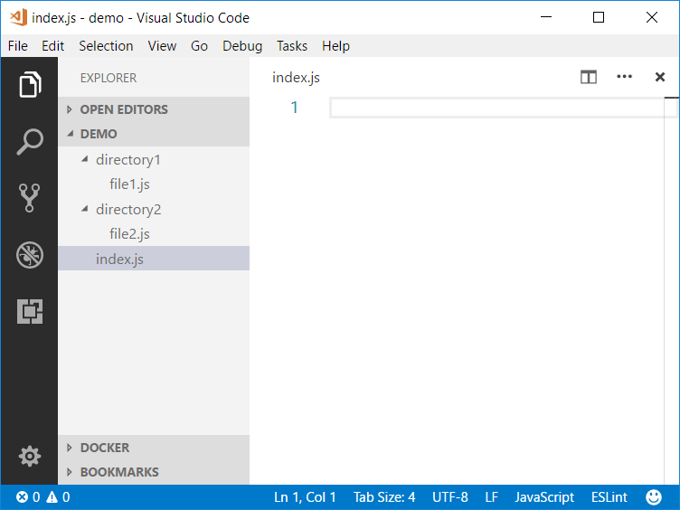
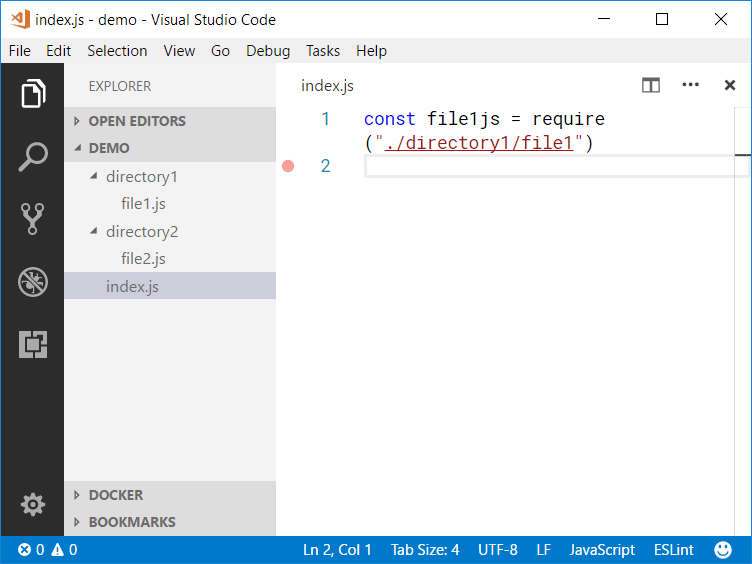

**Code Quicken** is yet another Visual Studio Code extension that helps inserting `import`/`require` snippets.

Previously, **Code Quicken** was generally designed to insert any snippets, but since **VS Code** version 1.17 introduced the built-in [snippet transformation](https://code.visualstudio.com/updates/v1_17#_snippet-transforms), the purpose of this extension has changed to inserting `import`/`require` statements only. If you are still using the features in the previous version, feel free to [download the VSIX file](https://github.com/ThisIsManta/vscode-code-quicken/raw/master/docs/code-quicken-0.0.10.vsix) and [manually install it](https://code.visualstudio.com/docs/editor/extension-gallery#_install-from-a-vsix).

This extension is heavily inspired by [**Quick Require**](https://marketplace.visualstudio.com/items?itemName=milkmidi.vs-code-quick-require), but it is written from scratch because it supports only `import` and `require` in JavaScript and could not be customized at all. For example, in some JavaScript convention, you might want to omit the JavaScript file extension (`.js`) and the semi-colon (`;`) at the end of the line, hence it becomes `import MyFile from './MyFile'`.

## Available commands

- Insert an import/require statement (default keybinding: *Ctrl+Shift+I*)
- Fix broken import/require statements

## Basic usage

Simply press _Ctrl+Shift+I_ on your keyboard to list all matching files, and choose one file that you would like to insert a snippet based on it.

Fixing broken path in an `import`/`require` statement has never been this easy. The command _Code Quicken: Fix broken import/require statements_ will try to find the closest match based on the file path without hassle. If more than one match is found, the extension will prompt you.

## Configurations

Once this extension has been installed, open Visual Studio Code settings to see all available options and their description.

## Supported languages

- JavaScript & TypeScript (`import` and `require`) for files and local Node modules.
- Stylus (`@import`, `@require`, and `url()`) for files.
