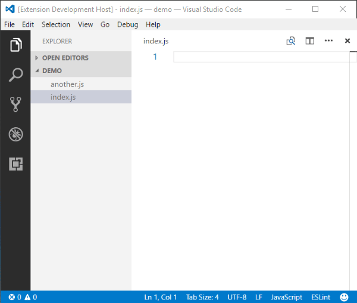
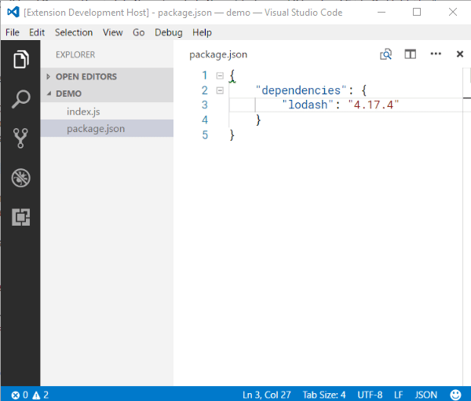

# Code Quicken

**Code Quicken** is a powerful **VS Code** extension for creating file-based context-aware snippets, such as `import` and `require` statements in JavaScript.

This extension is heavily inspired by [**Quick Require**](https://marketplace.visualstudio.com/items?itemName=milkmidi.vs-code-quick-require), but it is written from scratch because it supports only `import` and `require` in JavaScript and could not be customized at all. For example, in some JavaScript convention, you might want to omit the JavaScript file extension (`.js`) and the semi-colon (`;`) at the end of the line, hence it becomes `import MyFile from './MyFile'`.

You can also create a snippet for other languages as well, such as `@import './MyDesign.styl'` in [Stylus](http://stylus-lang.com/docs/import.html).

## Available commands

- Insert a snippet (Default keybinding: *Ctrl+Shift+I*)
- Insert a file-based snippet
- Insert a Node-module snippet
- Insert a context-aware snippet
- Fix broken import statements

## Basic usage

Simply press _Ctrl+Shift+I_ on your keyboard to list all macthing files, and choose one file that you would like to insert a snippet based on it.



Given the below settings, when pressing _Ctrl+Shift+I_, it will list all JavaScript files and insert a snippet `import MyFile from './MyFile.js';` before your first import statement. As you can see, `path` is a glob pattern matching all JavaScript files recusively, `code` is an ES6 template string (actually, it will be passed onto [lodash's template function](https://lodash.com/docs/4.17.4#template)), and `insertAt` represents the position of the code to be inserted.

```
"codeQuicken.files": [
  {
    "path": "**/*.js",
    "code": "import ${selectFileInfo.fileNameWithoutExtension} from '${selectFilePath}';\n",
    "insertAt": "beforeFirstImport"
  }
]
```

## Working with multiple file patterns

You can add multiple file patterns, so that it will insert one snippet for one kind of file, while it will insert another snippet for a different kind of file. Let's say you want to import another `js` and `css` files into a JavaScript file, choosing `MyFile.js` will insert `import MyFile from './MyFile.js';`, while choosing `MyDesign.css` will insert `import './MyDesign.css';`.

```
"codeQuicken.files": [
  {
    "path": "**/*.js",
    "code": "import ${selectFileInfo.fileNameWithoutExtension} from '${selectFilePath}';\n"
  },
  {
    "path": "**/*.css",
    "code": "import '${selectFilePath}';\n"
  }
]
```

## Working with one file in different context

Supposed you want to import one file to two different kind of files, such as importing `MyDesign.css` to both `MyFile.js` and `ChrisDesign.css`. You need two patterns which share the same `path`, but specifying when to use which pattern in `when` expression.

```
"codeQuicken.files": [
  {
    "path": "**/*.css",
    "when": "activeDocument.languageId === 'javascript'",
    "code": "import ${selectFilePath};\n"
  },
  {
    "path": "**/*.css",
    "when": "activeDocument.languageId === 'css'",
    "code": "@import '${selectFilePath}';\n"
  }
]
```

## Perks of JavaScript _(and TypeScript too)_

When importing JavaScript files, the extension will genuinely check if the chosen file has been imported already. This prevents duplicate import statements.


The extension also checks if the importing JavaScript file has `export default` or `module.exports`, so that you can use a variable `selectFileHasDefaultExport` in `code` setting.

```
"codeQuicken.files": [
  {
    "path": "**/*.js",
    "code": "import ${selectFileHasDefaultExport ? '' : '* as '}${selectFileInfo.fileNameWithoutExtension} from '${selectFilePath}';\n"
  }
]
```

## Working with **Node.js** modules

Furthermore, this extension also supports **Node.js** module snippets. The below is the default for `codeQuicken.nodes` setting. Since some node modules contain one or more dashes (`-`), which cannot be used in a JavaScript variable, a helping function `getProperVariableName()` can sanitize it. For example, `react-dom` will become `import reactDom from 'react-dom';`.

```
"codeQuicken.nodes": [
  {
    "name": "*",
    "code": "import ${getProperVariableName(moduleName)} from '${moduleName}';\n"
  }
]
```

## File settings

```
"codeQuicken.files": [
  {
    "path": string | string[],
    "when": string,
    "code": string | string[] | { "fromFile": string },
    "omitExtensionInSelectFilePath": boolean | string,
    "insertAt": string
  },
  ...
]
```

- `path`: a [glob pattern](https://www.npmjs.com/package/glob#glob-primer) of files to be listed in the quick pick.  
Specifying an exclamation mark (`!`) in front of the pattern will exclude those files from the list.
	```
	// This shows every JavaScript files
	"codeQuicken.files": [
	  {
		"path": "**/*.js",
		"code": "import ${selectFileInfo.fileNameWithoutExtension} from '${selectFilePath}';\n"
	  }
	]
	```
	```
	// This shows every JavaScript files, except ones in "node_modules" folder
	"codeQuicken.files": [
	  {
		"path": ["**/*.js", "!node_modules"],
		"code": "import ${selectFileInfo.fileNameWithoutExtension} from '${selectFilePath}';\n"
	  }
	]
	```

- `when`: a JavaScript boolean expression to control when this pattern is available against the current active document.  
You may use one or more following pre-defined variables:
  - `_` as **[lodash](https://www.npmjs.com/package/lodash)**.
  - `minimatch` as **[minimatch](https://www.npmjs.com/package/minimatch)**.
  - `path` as **Node.js**' [path](https://nodejs.org/api/path.html).
  - `activeDocument` as [vscode.window.activeTextEditor.document](https://code.visualstudio.com/docs/extensionAPI/vscode-api#TextDocument).
  - `activeFileInfo` as [FileInfo](#fileinfo-properties) object of the current active document.
	```
	// This shows every JavaScript files when the current viewing file name does not end with ".spec"
	"codeQuicken.files": [
	  {
		"path": "**/*.js",
		"when": "activeFileInfo.fileNameWithoutExtension.endsWith('.spec') === false",
		"code": "import ${selectFileInfo.fileNameWithoutExtension} from '${selectFilePath}';\n"
	  }
	]
	```

- `code`: an ES6 template string to be inserted to the current active document. Alternatively, you can pass `{ "fromFile": "./path/to/file.js" }` which contains `module.exports = function ({ activeDocument, ...more }) { return 'snippet' }`  
You may use one or more following pre-defined variables:
  - `activeDocument` as [vscode.window.activeTextEditor.document](https://code.visualstudio.com/docs/extensionAPI/vscode-api#TextDocument).
  - `activeFileInfo` as [FileInfo](#fileinfo-properties) object of the current active document.
  - `selectFileInfo` as [FileInfo](#fileinfo-properties) object of the chosen file.
  - `selectFilePath` as a normalized _relative file path_ of the chosen file. This has `./` at the beginning if and only if the chosen file and the current active document are in the same folder. This can be used safely in JavaScript `import` statement.
  - `selectCodeText` as a whole text of the chosen file.
  - `selectCodeTree` as a parsed **[Babylon](https://www.npmjs.com/package/babylon)** object of the chosen file.
  - `selectFileHasDefaultExport` as boolean that is `true` when the chosen file has `export default` or `module.exports`, otherwise `false`.
  - `isIndexFile` as boolean that is `true` when the chosen file is named "index" and does not share the same directory as the current active document, otherwise `false`.
  - `_` as **[lodash](https://www.npmjs.com/package/lodash)**.
  - `minimatch` as **[minimatch](https://www.npmjs.com/package/minimatch)**.
  - `path` as **Node.js**' [path](https://nodejs.org/api/path.html).
  - `getProperVariableName(text: string)` as a helping function that sanitizes the input string to a proper JavaScript variable name, such as `react-dom` to `reactDom`.
  - `getMatchingCodeNode(targetNode: object)` as a helping function that returns **Babylon** node if and only if at least one branch matches the given `targetNode`, otherwise `false`.
  - `getFilePath(pattern: string)` as a helping function that returns an array of [FileInfo](#fileinfo-properties) matches the given glob `pattern`.

- `omitExtensionInSelectFilePath`: a boolean or glob pattern of file extensions to remove from `selectFilePath` variable of `code` setting.  
Specifying `true` will strip all extension from `selectFilePath` variable of `code` setting.  
The default value is `false`.

- `insertAt`: a position of code to be inserted to the current active document.  
The possible values are: `"beforeFirstImport"`, `"afterLastImport"`, `"top"`, `"bottom"`, `"cursor"`.  
The default value is `cursor`.

## Node module settings



```
"codeQuicken.nodes": [
  {
    "name": string,
    "code": string | string[] | { "fromFile": string },
    "insertAt": string
  },
  ...
]
```

- `name`: a [glob pattern](https://www.npmjs.com/package/glob#glob-primer) of node module name.  
	```
	// This shows every node module that starts with `react`
	"codeQuicken.files": [
	  {
		"path": "react*",
		"code": "import ${getProperVariableName(moduleName)} from '${selectFilePath}';\n"
	  }
	]
	```

- `code`: an ES6 template string to be inserted to the current active document. Alternatively, you can pass `{ "fromFile": "./path/to/file.js" }` which contains `module.exports = function ({ activeDocument, ...more }) { return 'snippet' }`  
You may use one or more following pre-defined variables:
  - `activeDocument` as [vscode.window.activeTextEditor.document](https://code.visualstudio.com/docs/extensionAPI/vscode-api#TextDocument).
  - `activeFileInfo` as [FileInfo](#fileinfo-properties) object of the current active document.
  - `moduleName` as the name of the select node module.
  - `moduleVersion` as a version written in _package.json_ inside the select node module.
  - `_` as [lodash](https://www.npmjs.com/package/lodash).
  - `minimatch` as [minimatch](https://www.npmjs.com/package/minimatch).
  - `path` as [path](https://nodejs.org/api/path.html).
  - `getProperVariableName(text: string)` as a helping function that sanitizes the input string to a proper JavaScript variable name, such as `react-dom` to `reactDom`.
  - `getMatchingCodeNode(targetNode: object)` as a helping function that returns **Babylon** node if and only if at least one branch matches the given `targetNode`, otherwise `false`.
  - `getFilePath(pattern: string)` as a helping function that returns an array of [FileInfo](#fileinfo-properties) matches the given glob `pattern`.

- `insertAt`: a position of code to be inserted to the current active document.  
This is similar to [File settings](#file-settings).

## Inserting snippets

A text snippet borrows [VS Code snippet syntax](https://code.visualstudio.com/docs/editor/userdefinedsnippets#_snippet-syntax), but it adds an ability to write pure JavaScript code at the placeholder, so you can write `${1:activeFileInfo.fileNameWithoutExtension}` which gives you a tab-stop ability and a powerful string interpolation at the same time.

```
"codeQuicken.texts": [
  {
    "name": string,
    "when": string,
    "code": string | string[] | { "fromFile": string }
  },
  ...
]
```

- `name`: a name of this text snippet.

- `when`: a JavaScript boolean expression to control when this pattern is available against the current active document.

- `code`: an ES6 template string to be inserted to the current active document. Alternatively, you can pass `{ "fromFile": "./path/to/file.js" }` which contains `module.exports = function ({ activeDocument, ...more }) { return 'snippet' }`  
You may use one or more following pre-defined variables:
  - `activeDocument` as [vscode.window.activeTextEditor.document](https://code.visualstudio.com/docs/extensionAPI/vscode-api#TextDocument).
  - `activeFileInfo` as [FileInfo](#fileinfo-properties) object of the current active document.
  - `_` as **[lodash](https://www.npmjs.com/package/lodash)**.
  - `minimatch` as **[minimatch](https://www.npmjs.com/package/minimatch)**.
  - `path` as **Node.js**' [path](https://nodejs.org/api/path.html).
  - `getProperVariableName(text: string)` as a helping function that sanitizes the input string to a proper JavaScript variable name, such as `react-dom` to `reactDom`.
  - `getMatchingCodeNode(targetNode: object)` as a helping function that returns **Babylon** node if and only if at least one branch matches the given `targetNode`, otherwise `false`.
  - `getFilePath(pattern: string)` as a helping function that returns an array of [FileInfo](#fileinfo-properties) matches the given glob `pattern`.

## JavaScript parser settings

This extension uses **[Babylon](https://www.npmjs.com/package/babylon)** as a JavaScript parser, so it can detect `import`, `export`, `require` and `module.exports`. You may find the possible values for the plug-in names from [here](https://www.npmjs.com/package/babylon#plugins). The default value is showing below.

```
"codeQuicken.javascript.parser.plugins": [
  "jsx",
  "flow",
  "doExpressions",
  "objectRestSpread",
  "decorators",
  "classProperties",
  "exportExtensions",
  "asyncGenerators",
  "functionBind",
  "functionSent",
  "dynamicImport"
]
```

## **FileInfo** object

**FileInfo** is an object instance containing path-file-extension information.

- `fullPath`: a string represents path in the current operating system. For example, `c:\user\MyFile.js` in Windows, and `/c/user/MyFile.js` in Unix-like. 
- `fullPathForPOSIX`: a string represents path in Unix-like operating system.
- `fileNameWithExtension`
- `fileNameWithoutExtension`
- `fileExtensionWithoutLeadingDot`
- `directoryName`: a string represents only the containing directory to the path.
- `directoryPath`: a string represents series of directories to the path in local operating format.
- `directoryPathForPOSIX`: a string represents series of directories to the path in POSIX format.

For example, if you are working with **React**, you need to add `"jsx"` as one of the plug-ins, so this extension is able to work smoothly.
